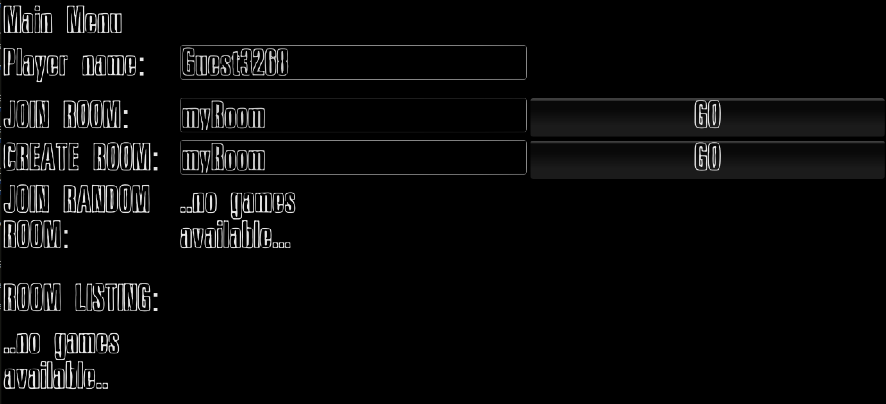
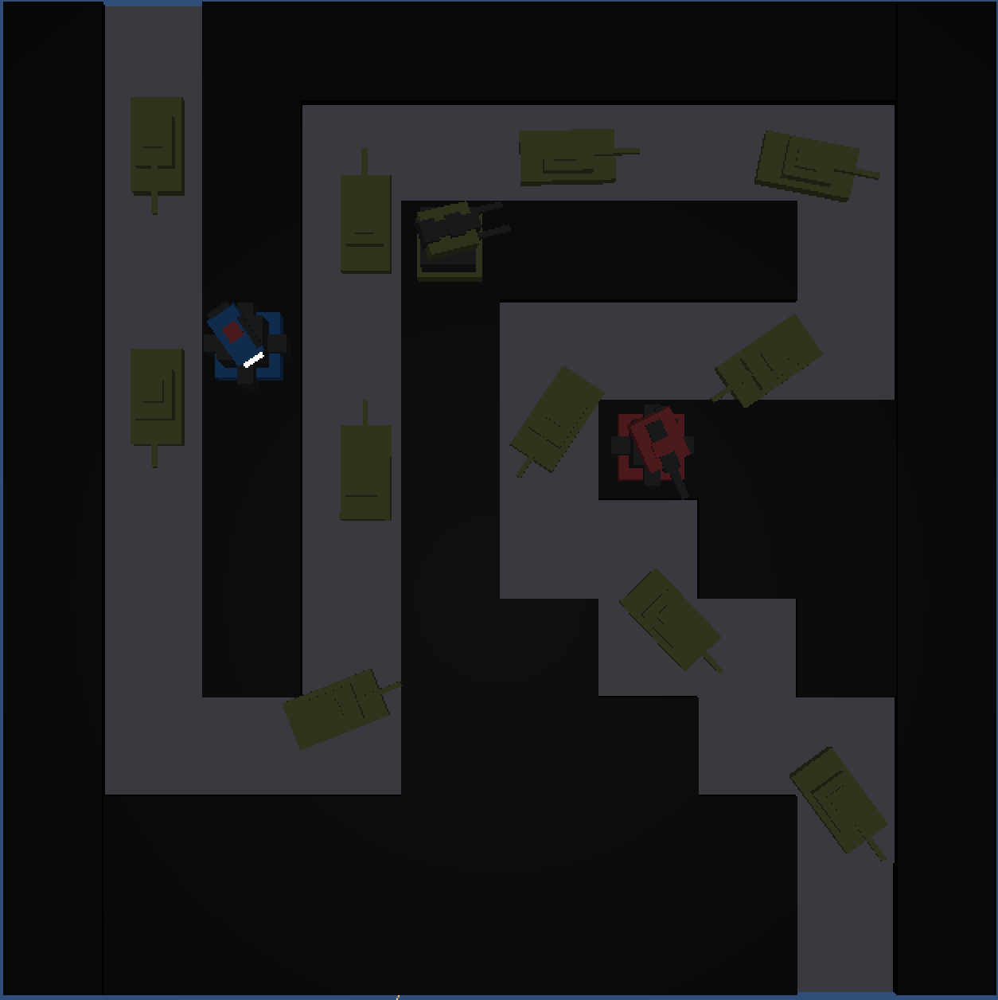

Online Multiplayer Tower Defence
===============

#Youtube Demo

##Photon Unity Networking
The Networking in this project is split up in to 3 distinct areas:

1. The Create/Join Main Menu UI.

- The list of available rooms is constantly polling the PUN servers for rooms registered to the application id that I specified in the project.

2. Generation of towers through player interaction on mouse click.
- On purchase of a tower through the buy menu the towers are instantiated on all of the clients that are subscribed to the room your in.

3. Generation of Enemy tanks.
- enemy tanks are generated by the master client (i.e whoever created the room). This is done so that the time delay and round start times are consistent across all players.

##UI design and layout
- The font design is inktank.ttf and was taken from http://www.dafont.com/
- The design leverages the inbuilt GUILayout functionality to create overlays on the main camera.

##Dynamic Content Generation
The level is dynamically generated through code and could easily be built upon for other levels.
The level also respects the AI pathing as we will discuss now.

##AStarPathfinding
The Pathfinding works by the raytracer detecting objects on a specific layer in unity and drawing a grid. It then looks at the seeker script on an object and plots the quickest path to the waypoint.

##WeaponSystem
The towers and enemies were taken from the weaponsystem asset package to save time.